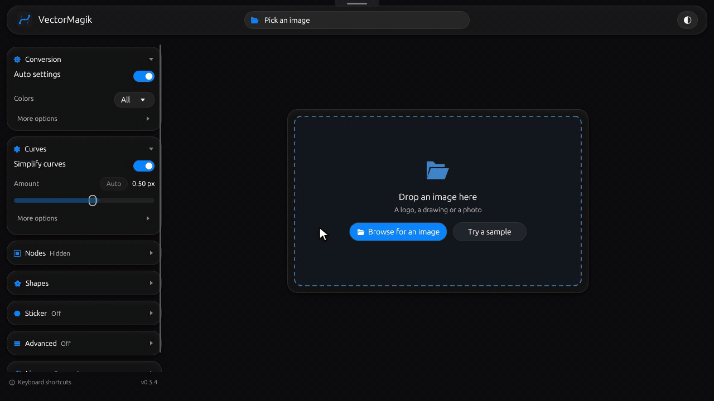
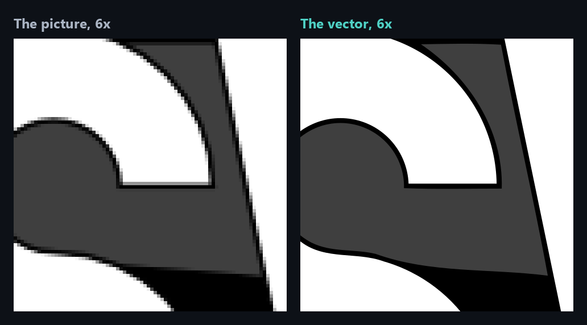
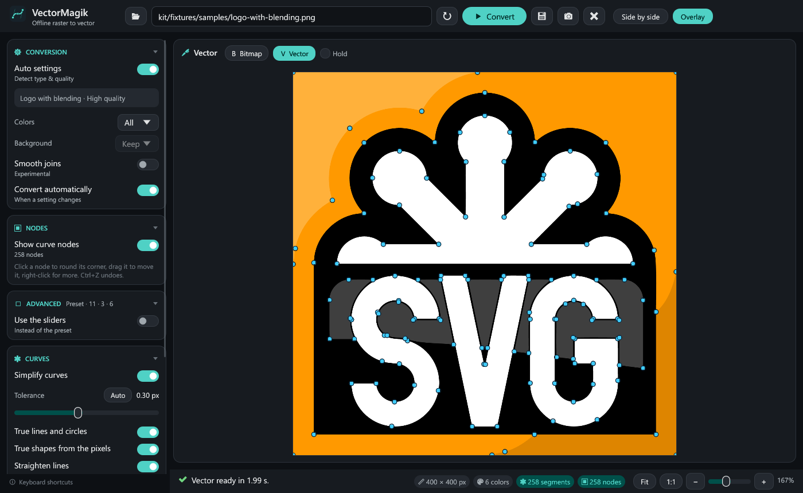
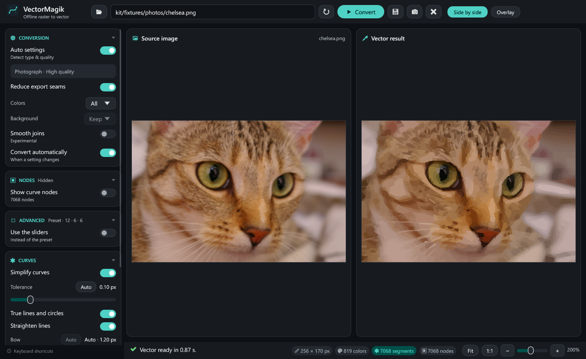

<div align="center">


# VectorMagik

### Pictures in, clean vectors out.

Turn logos, artwork, pixel art and photos into SVG, PDF or EPS. On Windows, Mac or Linux, or the very same app right in your browser.

[](#download)
[](#download)
[](#download)
[](https://vectormagik.lunarwerx.com/app/)
[](#how-it-works)
[](https://github.com/LunarWerxs/VectorMagik/releases)
[](#licence)
[](https://discord.gg/PsWpeNUzhk)

**⬇ Download for** [**Windows**](https://github.com/LunarWerxs/VectorMagik/releases/latest/download/VectorMagik-windows-x64.zip) · [**macOS**](https://github.com/LunarWerxs/VectorMagik/releases/latest/download/VectorMagik-macos-universal.zip) · [**Linux**](https://github.com/LunarWerxs/VectorMagik/releases/latest/download/VectorMagik-linux-x64.tar.gz) · [**▶ Try it in your browser**](https://vectormagik.lunarwerx.com/app/) · [Website](https://vectormagik.lunarwerx.com/) · [How it works](#how-it-works)

<br/>



</div>

---

## TL;DR

- 🎯 **Auto settings.** It works out whether you gave it a logo, pixel art or a photo, and traces it the right way.
- ⭕ **Clean geometry.** Circles come out as circles, lines as lines, and shapes the pixels clearly show (rectangles, ellipses, rounded corners) as those shapes.
- ✏️ **Finish by hand.** Show the nodes, round a corner, drag or delete a node, delete or merge shapes. Ctrl+Z undoes anything.
- 🌐 **The whole app in your browser, too.** The desktop app itself, compiled to WebAssembly: your picture never leaves your computer.
- 🔒 **Offline.** No account, no upload, no telemetry.
- 💻 **Windows, Mac and Linux.** One folder, nothing to install; on Windows and Linux the settings stay beside the app. The Windows app is signed by LUNARWERX LLC.
- 🎨 **Glass, light or dark.** Frosted panes after Apple's current design.
- 🧾 **Free** for personal use under PolyForm Noncommercial; [commercial licenses](https://vectormagik.lunarwerx.com/#license) are US$9 a month per seat.

<div align="center">



</div>

## Download

**[VectorMagik for Windows (x64)](https://github.com/LunarWerxs/VectorMagik/releases/latest/download/VectorMagik-windows-x64.zip)**: unzip it anywhere and run `VectorMagik.exe`. No installer. Windows may warn about an unrecognised app the first time; choose *More info* then *Run anyway*.

**[VectorMagik for macOS](https://github.com/LunarWerxs/VectorMagik/releases/latest/download/VectorMagik-macos-universal.zip)** (Apple Silicon and Intel, macOS 11 or newer): unzip it and move `VectorMagik.app` to Applications. It is not notarized by Apple yet, so the first time, right-click it and choose *Open*, or allow it under *System Settings*, *Privacy & Security*. The command line, `vector-magic-rebuild`, sits beside it.

**[VectorMagik for Linux (x64)](https://github.com/LunarWerxs/VectorMagik/releases/latest/download/VectorMagik-linux-x64.tar.gz)**: unpack it anywhere and run `./VectorMagik`. It runs on X11 or Wayland, on any distribution as new as Ubuntu 22.04 or Debian 12, and uses zenity or kdialog for the Open and Save dialogs.

No download? **[Open VectorMagik in your browser](https://vectormagik.lunarwerx.com/app/)**: the same app, on your own computer. The desktop app adds working with no internet at all, the command line and pictures up to 100 megapixels (50 in a tab); on Windows, dragging the file straight out of the window.

## What it does

<table>
<tr>
<td width="50%"></td>
<td width="50%"></td>
</tr>
<tr>
<td><b>Every node, yours to edit.</b> Click a corner to round it (Tiny, Tight, Medium or Wide), drag a node to move it, right-click to put it back or delete it (keeping the shape if you like).</td>
<td><b>Logos, pixel art and photos.</b> Each kind gets its own tracing, with the colors taken from the pixels themselves.</td>
</tr>
</table>

- **Simplify** removes nodes while the picture stays the same; drag it all the way and circles still come out round.
- **Shapes**: select shapes to delete them (a background, say) or merge two shades into one.
- **Colors and background**: limit the picture to 1 to 64 colors, or flatten transparency onto a color.
- **Stickers**: a die-cut outline with a white rim and an optional shadow.
- **Save** SVG, PDF or EPS at any size, or drag the file straight out of the window.

## Command line

`vector-magic-rebuild.exe` in the same folder does the same work without a window:

```text
vector-magic-rebuild picture.png -o picture.svg --category auto --quality auto --simplify auto
```

The app's own chain is `--category auto --quality auto --simplify auto --regularize 0.8 --straighten auto --primitives on --stack on`. Run it with `--help` for every option.

## Build from source

With a current stable Rust toolchain:

```text
cargo build --release --manifest-path kit/app/Cargo.toml --features desktop
cargo test --release --manifest-path kit/rust/Cargo.toml
cargo test --release --manifest-path kit/app/Cargo.toml --features desktop
```

The programs land in `kit/app/target/release/`. The browser build is `kit/web`, the desktop's window code without the window: `cargo build --release --manifest-path kit/web/Cargo.toml --target wasm32-unknown-unknown`, drawn on a canvas by `kit/web/js/app.mjs` (a small WebGL painter, nothing else); `node kit/web/js/test.mjs path/to/vectormagik_web.wasm` drives it the way a page does and checks its drawings against the command line's.

## How it works

VectorMagik is an independent reimplementation, in Rust, of the tracing engine of Vector Magic's desktop program, reconstructed stage by stage from the original program (segmentation, contour construction, smoothing, curve fitting and export) and checked against it: under `--defaults original` it reproduces the original's output byte for byte on the reference pictures in `kit/fixtures/reference`. On top of that engine it adds its own improvements, each measured before it became a default: better tracing settings, true lines, circles and shapes, straightening, simplification that keeps circles round, fills taken from the pixels, and the editor.

The browser version is the same Rust, window code included, compiled to WebAssembly. It draws the same file as the desktop app, byte for byte, on 52 of the 53 test pictures; the 53rd draws the same rectangle starting from a different corner.

VectorMagik is not affiliated with, endorsed by or connected to Vector Magic, Inc. "Vector Magic" is their trademark. It contains none of the original program's machine code or files.

## Licence

Free for personal and other noncommercial use under the [PolyForm Noncommercial License 1.0.0](LICENSE). Commercial use needs a license, US$9 a month per seat: [buy one on the site](https://vectormagik.lunarwerx.com/#license) and paste its key into the app's License card.

Required Notice: Copyright (c) 2026 LunarWerx.

The test pictures are free to use: the sample logos are public domain or freely licensed (`kit/fixtures/samples/LICENSE.txt`), and the photographs come from scikit-image's sample data (astronaut: NASA, public domain; coffee: Rachel Michetti, CC0; chelsea: Stefan van der Walt, CC0).
