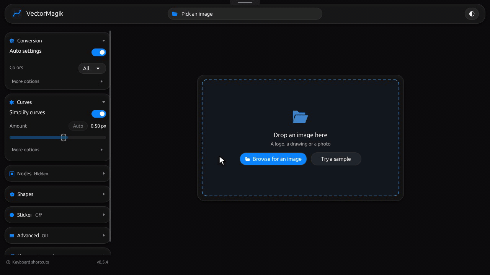
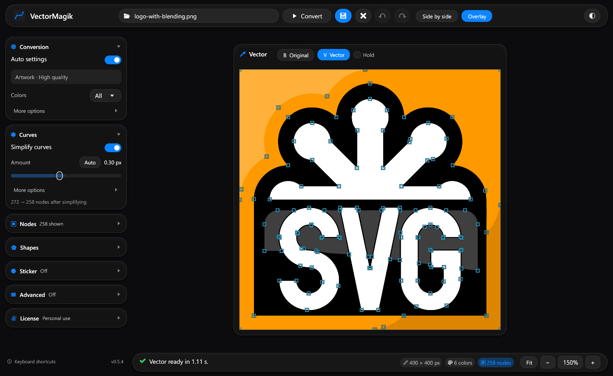
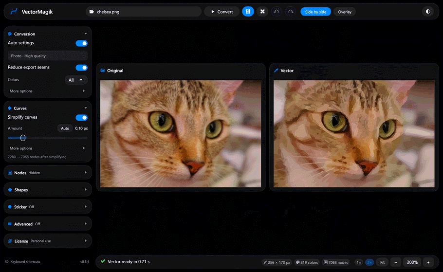

<div align="center">


# VectorMagik

### Pictures in, clean vectors out.

Turn logos, artwork, pixel art and photos into SVG, PDF or EPS. On Windows, Mac or Linux, or the very same app right in your browser.

[](#download)
[](#download)
[](#download)
[](https://vectormagik.lunarwerx.com/app/)
[](https://vectormagik.lunarwerx.com/)
[](https://github.com/LunarWerxs/VectorMagik/releases)
[](#licence)
[](https://discord.gg/PsWpeNUzhk)

**⬇ Download for** [**Windows**](https://github.com/LunarWerxs/VectorMagik/releases/latest/download/VectorMagik-windows-x64-setup.exe) · [**macOS**](https://github.com/LunarWerxs/VectorMagik/releases/latest/download/VectorMagik-macos-universal.zip) · [**Linux**](https://github.com/LunarWerxs/VectorMagik/releases/latest/download/VectorMagik-linux-x64.deb) · [**▶ Try it in your browser**](https://vectormagik.lunarwerx.com/app/) · [Website](https://vectormagik.lunarwerx.com/)

<br/>



</div>

---

## TL;DR

- 🎯 **Auto settings.** It works out whether you gave it a logo, pixel art or a photo, and traces it the right way.
- ⭕ **Clean geometry.** Circles come out as circles, lines as lines, and shapes the pixels clearly show (rectangles, ellipses, rounded corners) as those shapes.
- ✏️ **Finish by hand.** Show the nodes, round a corner, drag or delete a node, delete or merge shapes. Ctrl+Z undoes anything.
- 🌐 **The whole app in your browser, too.** The desktop app itself, compiled to WebAssembly: your picture never leaves your computer.
- 📂 **Batches and vector files.** Drop several pictures at once, or open a PDF, Illustrator, SVG or Photoshop file and keep how it looks.
- 🔒 **Private.** No account, and your pictures never leave your computer; it works offline. It counts its use anonymously: [what it sends](https://vectormagik.lunarwerx.com/privacy/).
- 💻 **Windows, Mac and Linux.** A Windows installer that keeps itself up to date, a Debian/Ubuntu package, or one portable folder that keeps its settings beside the app. The Windows programs are signed by LUNARWERX LLC.
- 🎨 **Glass, light or dark.** Frosted panes after Apple's current design.
- 🧾 **Free** for personal use under PolyForm Noncommercial; [commercial licenses](https://vectormagik.lunarwerx.com/#license) are US$9 a month per seat.

<div align="center">


</div>

## Download

**[VectorMagik for Windows (x64)](https://github.com/LunarWerxs/VectorMagik/releases/latest/download/VectorMagik-windows-x64-setup.exe)**: open it and press *Install*; it installs for you alone, needs no administrator rights, updates itself in one click when a new version is out, and Settings > Apps uninstalls it. Or take the **[portable zip](https://github.com/LunarWerxs/VectorMagik/releases/latest/download/VectorMagik-windows-x64.zip)**: unzip it anywhere and run `VectorMagik.exe`, nothing installed. Windows may warn about an unrecognised app the first time; choose *More info* then *Run anyway*.

**[VectorMagik for macOS](https://github.com/LunarWerxs/VectorMagik/releases/latest/download/VectorMagik-macos-universal.zip)** (Apple Silicon and Intel, macOS 11 or newer): unzip it and move `VectorMagik.app` to Applications. It is not notarized by Apple yet, so the first time, right-click it and choose *Open*, or allow it under *System Settings*, *Privacy & Security*. The command line, `vectormagik-cli`, sits beside it.

**[VectorMagik for Linux (x64)](https://github.com/LunarWerxs/VectorMagik/releases/latest/download/VectorMagik-linux-x64.deb)**: on Debian, Ubuntu and their kin, `sudo apt install ./VectorMagik-linux-x64.deb`, then open VectorMagik from the menu (or run `vectormagik`). Or take the **[portable archive](https://github.com/LunarWerxs/VectorMagik/releases/latest/download/VectorMagik-linux-x64.tar.gz)**: unpack it anywhere and run `./VectorMagik`. It runs on X11 or Wayland, on any distribution as new as Ubuntu 22.04 or Debian 12, and uses zenity or kdialog for the Open and Save dialogs.

**The engine alone**, for an AI assistant or a script, without the window: [Windows](https://github.com/LunarWerxs/VectorMagik/releases/latest/download/VectorMagik-engine-windows-x64.zip) · [macOS](https://github.com/LunarWerxs/VectorMagik/releases/latest/download/VectorMagik-engine-macos-universal.zip) · [Linux](https://github.com/LunarWerxs/VectorMagik/releases/latest/download/VectorMagik-engine-linux-x64.tar.gz) ([how](#for-ai-assistants-mcp)).

No download? **[Open VectorMagik in your browser](https://vectormagik.lunarwerx.com/app/)**: the same app, on your own computer. The desktop app adds working with no internet at all, the command line and pictures up to 100 megapixels (50 in a tab); on Windows, dragging the file straight out of the window.

## What it does

<table>
<tr>
<td width="50%"></td>
<td width="50%"></td>
</tr>
<tr>
<td><b>Every node, yours to edit.</b> Click a corner to round it (Tiny, Tight, Medium or Wide), drag a node to move it, right-click to put it back or delete it (keeping the shape if you like).</td>
<td><b>Logos, pixel art and photos.</b> Each kind gets its own tracing, with the colors taken from the pixels themselves.</td>
</tr>
</table>

- **Simplify** removes nodes while the picture stays the same; drag it all the way and circles still come out round.
- **Shapes**: select shapes to delete them (a background, say) or merge two shades into one.
- **Colors and background**: merge the tracing down to 1 to 64 colors, or flatten transparency onto a color.
- **Stickers**: a die-cut outline with a white rim and an optional shadow.
- **Save** SVG, PDF or EPS at any size, or drag the file straight out of the window.
- **Vector and Photoshop files** open as they look: a PDF, Illustrator, EPS or SVG file keeps its text, pictures and gradients, a Photoshop file every visible layer, and a file with several pages lets you pick one.
- **Batches**: drop several files at once and they all convert with the same settings.

## Command line

`vectormagik-cli.exe` in the same folder does the same work without a window:

```text
vectormagik-cli picture.png -o picture.svg --category auto --quality auto --simplify auto
```

The app's own chain is `--category auto --quality auto --sharpen on --simplify auto --corners on --regularize 0.8 --straighten auto --primitives on --gradients on --stack on`. Run it with `--help` for every option.

## For AI assistants (MCP)

The same program is an [MCP](https://modelcontextprotocol.io) server: started with `--mcp`, it lets an AI assistant trace pictures on your computer. Download [the engine alone](#download) (or use the one beside the app) and add it to your assistant. In Claude Code:

```text
claude mcp add vectormagik -- /path/to/vectormagik-cli --mcp
```

In Claude Desktop, Cursor and other clients, the server's entry is:

```json
"vectormagik": { "command": "/path/to/vectormagik-cli", "args": ["--mcp"] }
```

The assistant gets three tools:

- **vectorize**: trace a picture and save it as SVG, PDF, EPS, AI, DXF, EMF or PNG, with the app's Auto settings unless it asks for others, and see a picture of the result. Vector files (SVG, PDF, AI, EPS) are converted as they are or traced.
- **inspect**: a file's size, transparency and colours, and the image type and quality Auto would choose.
- **view**: any picture or vector file as an image the assistant can look at.

It runs only on your computer, reads and writes the files it is given, and never goes online.

## Licence

Free for personal and other noncommercial use under the [PolyForm Noncommercial License 1.0.0](LICENSE). Commercial use needs a license, US$9 a month per seat: [buy one on the site](https://vectormagik.lunarwerx.com/#license) and paste its key into the app's License card.

Required Notice: Copyright (c) 2026 LunarWerx.
